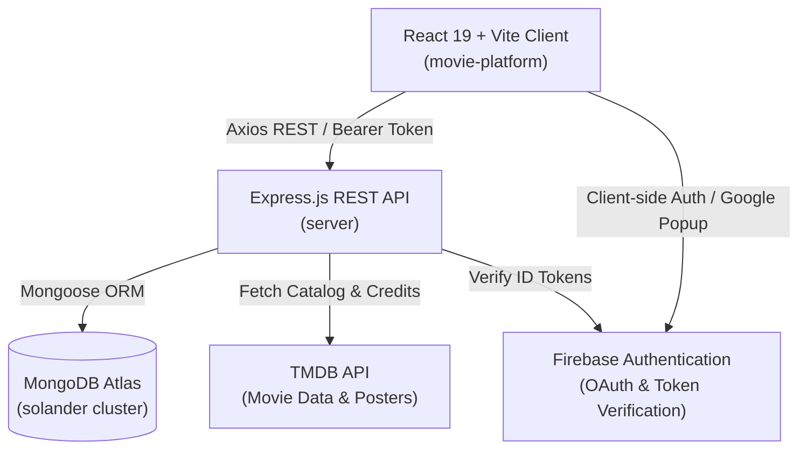
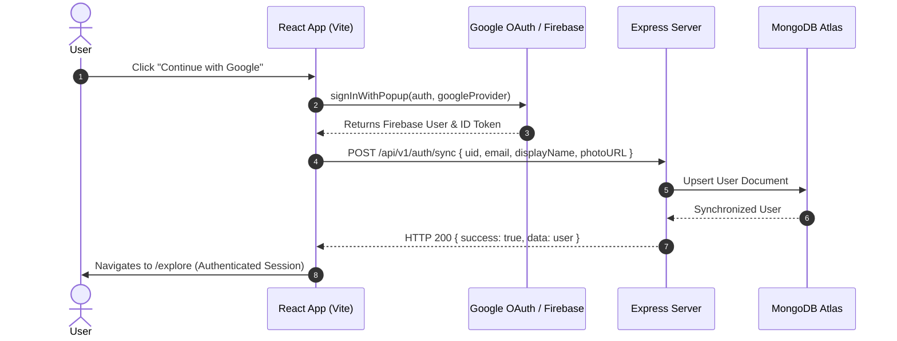

# 🎬 SOLANDER — Cinema Archive & Discovery Platform

<div align="center">


**A high-aesthetic, Letterboxd-inspired film discovery, viewing diary, and watchlist platform.**

[](https://react.dev/)
[](https://vitejs.dev/)
[](https://nodejs.org/)
[](https://www.mongodb.com/)
[](https://firebase.google.com/)
[](https://www.themoviedb.org/)

</div>

---

## 📖 Table of Contents

- [Overview](#-overview)
- [Key Features](#-key-features)
- [Architecture & Tech Stack](#-architecture--tech-stack)
- [Project Structure](#-project-structure)
- [Getting Started](#-getting-started)
  - [Prerequisites](#prerequisites)
  - [Installation](#installation)
  - [Environment Variables](#environment-variables)
  - [Running the Application](#running-the-application)
- [API Reference](#-api-reference)
- [Authentication Workflow](#-authentication-workflow)
- [Deployment Guide](#-deployment-guide)
  - [Frontend (Vercel / Netlify)](#frontend-vercel--netlify)
  - [Backend (Render / Railway)](#backend-render--railway)
- [License](#-license)

---

## 📽 Overview

**SOLANDER** is a modern full-stack web application designed for film enthusiasts, critics, and casual viewers alike. Inspired by classical editorial typography and dark minimalist aesthetics, it enables users to seamlessly explore global cinema, log their viewing diary with personal reflections and star ratings, curate custom watchlists, and break decision fatigue via an interactive Cinema Roulette.

---

## ✨ Key Features

- **🌐 Film Discovery & Search**:
  - Live TMDB integration for popular releases, top-rated masterworks, and fast debounced query searching.
  - Rich metadata display: official posters, high-res backdrops, release year, runtime, directors, cast, and genres.
- **📝 Viewing Diary**:
  - Log films with 5-star precision ratings, custom reviews, watch dates, and "rewatch" flags.
  - Edit or delete diary entries anytime with real-time statistics updating.
- **🔖 Curated Watchlist**:
  - One-click film bookmarking from any movie detail modal or discovery card.
  - Track priority notes and mark movies as watched to instantly transfer them into your diary.
- **🎲 Cinema Roulette**:
  - Overcome viewing paralysis with a randomized cinema selector.
  - Filter by era (e.g., 1970s New Hollywood, 1990s Golden Era), genre, runtime ceiling, and minimum TMDB community rating.
- **👤 Cinephile Profile**:
  - Track total logged hours, films watched, and personal average rating.
  - Showcase your curated "Top 4 Favorite Films".
  - Manage and customize bio, handle, and display name.
- **🔐 Secure Authentication**:
  - **Email & Password**: Robust registration with custom handles and password reveal toggles.

---

## 🛠 Architecture & Tech Stack



### Frontend (`/movie-platform`)
- **Framework**: React 19 with Vite 8
- **Routing**: React Router DOM 7 (with `ProtectedRoute` route guards)
- **Styling**: Modern Vanilla CSS Design System (Glassmorphic cards, custom typography tokens, fluid layout, responsive breakpoints)
- **Icons**: Lucide React
- **HTTP Client**: Axios with automatic bearer token injection and error normalizing interceptors
- **Authentication**: Firebase Client SDK v12

### Backend (`/server`)
- **Runtime**: Node.js with ES Modules (`import`/`export`)
- **Framework**: Express.js
- **Database**: MongoDB Atlas with Mongoose ORM
- **Security**: Helmet security headers, CORS multi-origin resolution, Express Rate Limiting
- **External APIs**: The Movie Database (TMDB) API v3

---

## 📂 Project Structure

```text
final/
├── package.json               # Root monorepo deployment & run scripts
├── .env.example               # Root environment variable documentation
│
├── movie-platform/            # React + Vite Frontend
│   ├── public/
│   │   └── _redirects         # SPA routing rewrites for Netlify/static hosts
│   ├── src/
│   │   ├── components/
│   │   │   ├── common/        # ProtectedRoute, UI modals
│   │   │   ├── layout/        # Navbar, footer, navigation
│   │   │   └── movies/        # MovieCard, QuickLogModal, CastList
│   │   ├── config/            # Firebase client initialization
│   │   ├── context/           # AuthContext (state, Google/Email/Demo handlers)
│   │   ├── pages/             # HomePage, ExplorePage, MovieDetailPage,
│   │   │                      # DiaryPage, WatchlistPage, RoulettePage,
│   │   │                      # LoginPage, ProfilePage
│   │   ├── services/          # Axios API client & endpoint helpers
│   │   ├── App.jsx            # Route definitions & theme shell
│   │   ├── index.css          # Core design system & CSS variables
│   │   └── main.jsx           # App bootstrap
│   ├── vercel.json            # SPA routing rewrites for Vercel deployment
│   ├── vite.config.js
│   ├── .env.example
│   └── package.json
│
└── server/                    # Node.js + Express Backend
    ├── src/
    │   ├── config/            # db.js (MongoDB Atlas), firebaseAdmin.js
    │   ├── controllers/       # authController, movieController, diaryController, watchlistController
    │   ├── middleware/        # authMiddleware, errorHandler, rateLimiter
    │   ├── models/            # User, DiaryEntry, WatchlistItem (Mongoose schemas)
    │   ├── routes/            # Express routers (/auth, /movies, /diary, /watchlist, /health)
    │   ├── services/          # tmdbService.js
    │   ├── app.js             # Express app setup & CORS configuration
    │   └── server.js          # Server bootstrap
    ├── .env.example
    └── package.json
```

---

## 🚀 Getting Started

### Prerequisites

- [Node.js](https://nodejs.org/) (v18 or higher recommended)
- [npm](https://www.npmjs.com/)
- A free [TMDB Account & API Key](https://www.themoviedb.org/settings/api)
- A [MongoDB Atlas](https://www.mongodb.com/cloud/atlas) cluster or local MongoDB instance

---

### Installation

Clone the repository and install dependencies for both the backend and frontend:

```bash
# 1. Install backend dependencies
cd server
npm install

# 2. Install frontend dependencies
cd ../movie-platform
npm install

# 3. Return to root
cd ..
```

---

### Environment Variables

#### 1. Backend (`server/.env`)

Create `server/.env` based on `server/.env.example`:

```env
PORT=5000
NODE_ENV=development
CLIENT_URL=http://localhost:5173

# MongoDB Atlas Connection URI
MONGODB_URI=mongodb+srv://<username>:<password>@<cluster>.mongodb.net/movie_platform?retryWrites=true&w=majority

# TMDB API Key (v3)
TMDB_API_KEY=your_tmdb_api_key_here

# Optional: Firebase Admin (if verifying real ID tokens via service account)
FIREBASE_SERVICE_ACCOUNT_PATH=./config/serviceAccountKey.json
FIREBASE_PROJECT_ID=your-firebase-project-id
```

#### 2. Frontend (`movie-platform/.env`)

Create `movie-platform/.env` based on `movie-platform/.env.example`:

```env
VITE_API_URL=http://localhost:5000/api/v1

# Firebase Web App Credentials (from Firebase Console -> Project Settings)
VITE_FIREBASE_API_KEY=your_firebase_api_key
VITE_FIREBASE_AUTH_DOMAIN=your_project.firebaseapp.com
VITE_FIREBASE_PROJECT_ID=your_project_id
VITE_FIREBASE_STORAGE_BUCKET=your_project.appspot.com
VITE_FIREBASE_MESSAGING_SENDER_ID=your_messaging_sender_id
VITE_FIREBASE_APP_ID=your_app_id
```

---

### Running the Application

You can start both services concurrently or individually:

#### Running the Backend API:
```bash
cd server
npm run dev
# Server will start on http://localhost:5000
```

#### Running the Frontend Client:
```bash
cd movie-platform
npm run dev
# Vite will launch on http://localhost:5173
```

---

## 📡 API Reference

Base URL: `http://localhost:5000/api/v1`

| Method | Endpoint | Description | Auth Required |
| :--- | :--- | :--- | :---: |
| `GET` | `/health` | Server & Database connectivity status | No |
| `POST` | `/auth/sync` | Sync Firebase user profile with MongoDB | Optional |
| `GET` | `/auth/me` | Retrieve authenticated user profile & stats | **Yes** |
| `PATCH` | `/auth/me` | Update user bio, display name, or top 4 films | **Yes** |
| `GET` | `/movies/popular` | Fetch paginated popular movies from TMDB | No |
| `GET` | `/movies/top-rated`| Fetch paginated top-rated cinema classics | No |
| `GET` | `/movies/search?q=`| Full-text movie search across TMDB | No |
| `GET` | `/movies/:tmdbId` | Detailed film profile, backdrop & cast list | No |
| `GET` | `/diary` | Fetch current user's paginated diary entries | **Yes** |
| `POST` | `/diary` | Log a film with star rating, review & date | **Yes** |
| `PUT` | `/diary/:id` | Update an existing diary entry | **Yes** |
| `DELETE`| `/diary/:id` | Remove an entry from the diary | **Yes** |
| `GET` | `/diary/check/:tmdbId` | Check if a film has already been logged | **Yes** |
| `GET` | `/watchlist` | Fetch current user's movie watchlist | **Yes** |
| `POST` | `/watchlist` | Add a film to the watchlist | **Yes** |
| `PATCH`| `/watchlist/:id` | Update watchlist item notes or status | **Yes** |
| `DELETE`| `/watchlist/:id` | Remove a film from the watchlist | **Yes** |

---

## 🔒 Authentication Workflow



- **Token Interception**: Axios automatically adds `Authorization: Bearer <token>` to all protected API calls.
- **In-Memory Fallback**: If the MongoDB Atlas connection is in transition, the server activates a zero-downtime in-memory fallback layer to prevent request crashes.

---

## 🚢 Deployment Guide

### Frontend (Vercel / Netlify)

1. Connect your repository to **Vercel** or **Netlify**.
2. Set **Root Directory** to `movie-platform`.
3. Set **Build Command** to: `npm run build`.
4. Set **Output Directory** to: `dist`.
5. Add Environment Variables:
   - `VITE_API_URL`: URL of your deployed Express backend (e.g. `https://your-api.onrender.com/api/v1`).
   - `VITE_FIREBASE_*`: Your Firebase project Web App configuration.
6. *Routing Note*: The included `movie-platform/vercel.json` and `movie-platform/public/_redirects` automatically resolve client-side SPA routing without 404s.

### Backend (Render / Railway)

1. Connect your repository to **Render** or **Railway** (Web Service).
2. Set **Root Directory** to `server`.
3. Set **Build Command** to: `npm install`.
4. Set **Start Command** to: `node src/server.js`.
5. Add Environment Variables:
   - `NODE_ENV`: `production`
   - `PORT`: `5000` (or leave default assigned by platform)
   - `CLIENT_URL`: `https://your-frontend.vercel.app`
   - `MONGODB_URI`: Your MongoDB Atlas connection string
   - `TMDB_API_KEY`: Your TMDB API key
6. In **MongoDB Atlas** → **Network Access**, ensure the outbound IP of your hosting platform (or `0.0.0.0/0`) is whitelisted.

---

## 📄 License

This project is open-source under the [ISC License](LICENSE).
Built with passion for the craft of cinema.
